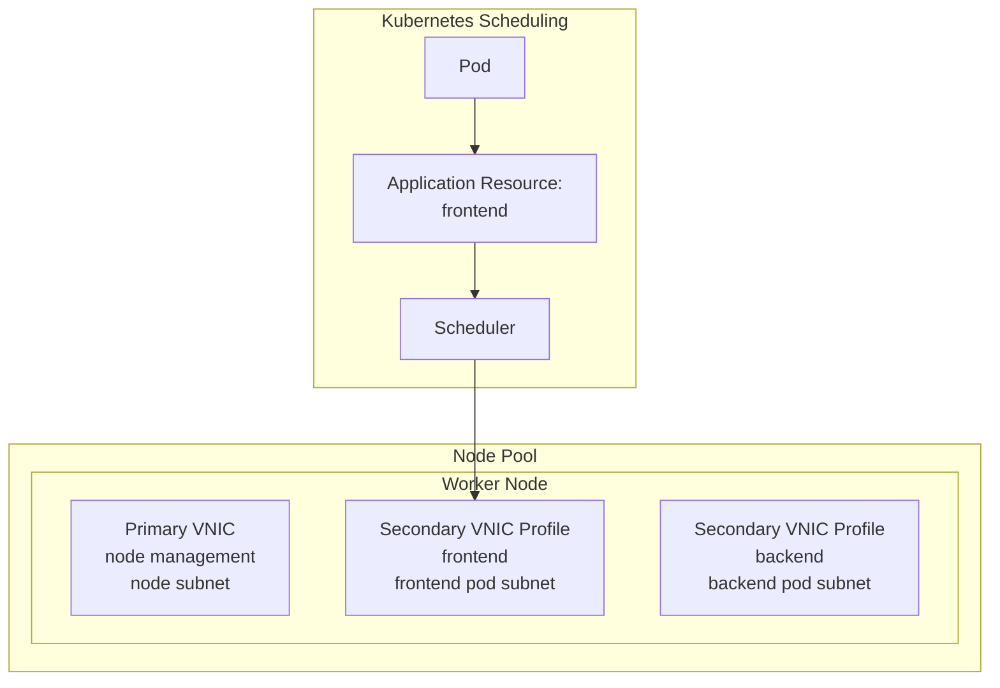
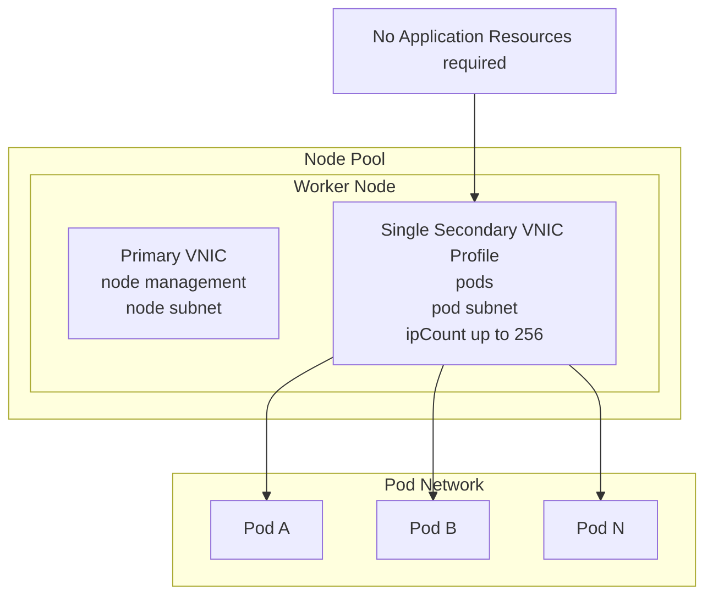
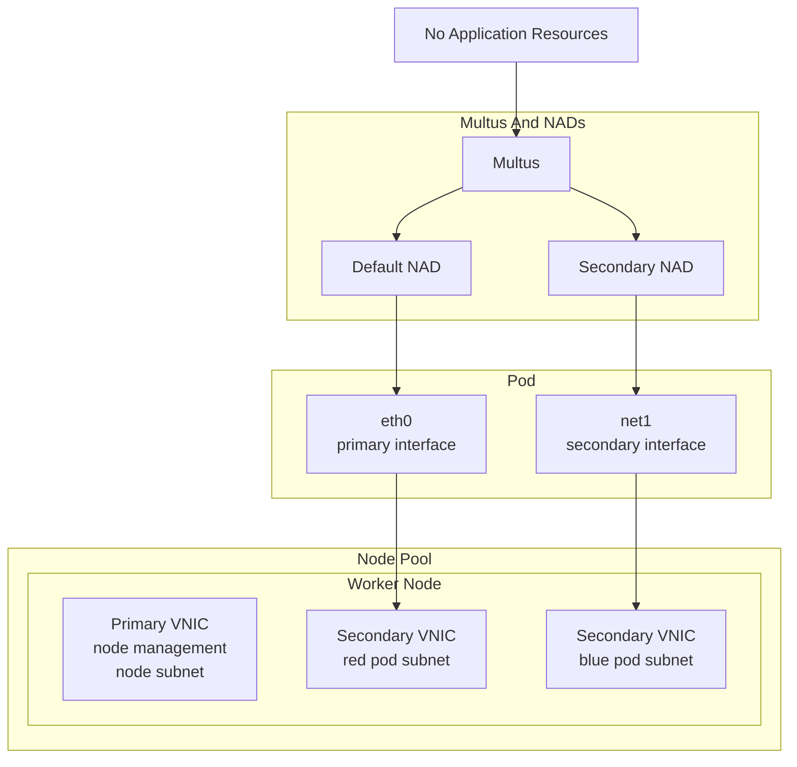

# Generic VNIC Attachment (GVA) for OKE

Technical Documentation Draft | Consolidated from `gva-documentation-v4.docx`, `notes`, and `oke-multus-multi-home-3-25.docx` | March 2026

## 1. Overview

Generic VNIC Attachment (GVA) is an OKE networking capability for VCN-Native pod networking that lets a node pool attach multiple secondary VNIC profiles with different subnet, NSG, and IP allocation settings.

GVA is most useful when you need:

- Pod traffic isolation by subnet or NSG
- Different routing or security controls for different workload classes
- More control over how many IP addresses are assigned to pod networking on each worker node
- Higher per-worker pod IP capacity than the default 32-pod limit in constrained VCN-native deployments, with up to 256 pod IPs per GVA VNIC profile
- Multiple node interfaces available for multi-interface pod designs

## 2. Decision Guide

Choose the design first, because the configuration model is different depending on whether the pod needs one network path or multiple interfaces.

### 2.1 Single-Interface Workloads

Section 2.1 covers two single-interface patterns:

- Single-interface workload isolation across multiple selectable secondary VNIC profiles by using Application Resources
- Single secondary VNIC designs used to increase `ipCount` and raise per-node pod IP capacity without Application Resources

Use Application Resources when a node pool exposes multiple selectable secondary VNIC profiles and a pod should run on exactly one selected profile enforced by scheduling. Application Resources are mainly needed when multiple secondary VNIC profiles are attached to the same node and workloads must be pinned to one selected profile. Each pod can request only one Application Resource.

If the use case does not require multiple secondary VNIC profiles, such as using a single secondary VNIC to increase pod IP capacity on a worker node or to control how many IP addresses are assigned to pod networking on that node, Application Resources are not required. In this model, pod IP capacity is sized through one GVA VNIC profile and supports up to 256 pod IPs. Actual schedulable pod count also depends on kubelet `max-pods`, daemonsets, `hostNetwork` pods, and other node-level limits.

Application Resources are intended for:

- Pinning a workload type to a specific VNIC profile
- Applying different NSGs or route tables to different pod groups
- Ensuring the scheduler places pods only on nodes that expose the required network resource

### 2.2 Multi-Interface Pod Networking

Use GVA with Multus and NADs when a pod must use multiple interfaces.

In this design:

- GVA prepares the worker node with multiple secondary VNICs
- Multus attaches multiple pod interfaces
- NADs define which host interface each pod interface should use
- Application Resources should not be used, because they pin the pod to a single selected VNIC profile on the node

### 2.3 Behavior Without Application Resources

If an Application Resource is not used, a pod that is already scheduled onto the node is not pinned to a single GVA VNIC profile and may be allocated from any secondary VNIC profile on that node that is available for pod IP allocation in the current node-pool configuration. Which profile is chosen is determined by the CNI and IPAM behavior for that node. This behavior is separate from taints, tolerations, and other scheduler placement controls.

For single-secondary-VNIC designs used only to increase pod IP capacity or control per-node pod IP allocation, this is expected and does not require Application Resources.

## 3. Prerequisites

Before enabling GVA, confirm the following:

- The OKE cluster uses `OCI_VCN_IP_NATIVE` (VCN-Native CNI)
- Multi-interface pod support with OCI VCN-Native CNI requires version `3.2.0` or later
- The required secondary subnets already exist
- The required NSGs and route tables are defined for each traffic tier
- The node shape supports the required number of VNIC attachments
- The node pool has permission to create and manage VNICs
- The OCI CLI version in use supports GVA flags
- Pod subnets used with GVA are configured with a minimum of two CIDR blocks
- Multus CNI is deployed if multi-interface pods are required
- The `ipvlan` CNI plugin is installed on worker nodes if Multus will attach secondary pod interfaces

GVA is not supported with Flannel.

### 3.1 Required OCI CLI Version For LA

For LA environments covered by the source material, GVA requires the preview OCI CLI version `3.65.2+preview.1.1355`.

Install the preview version of the OCI CLI:

```bash
pip install --trusted-host=artifactory.oci.oraclecorp.com \
  -i https://artifactory.oci.oraclecorp.com/api/pypi/global-dev-pypi/simple \
  -U oci-cli==3.65.2+preview.1.1355
```

If the Python wheel is already downloaded:

```bash
pip install /path/to/oci_cli-3.65.2+preview.1.1355-py3-none-any.whl
```

This LA-specific requirement comes from the source Word documents and should be replaced with public OCI CLI installation guidance and a generally supported minimum version before external publication.

## 4. Core Concepts

### 4.1 VNIC Roles

- Primary VNIC: used for node management and control plane communication
- Secondary VNICs: used for pod networking
- Application Resource: a label that maps a pod request to one GVA VNIC profile when multiple secondary VNIC profiles are exposed on the node

### 4.2 Scheduler Behavior

When a pod requests an Application Resource:

1. The admission webhook validates the request.
2. The scheduler searches for a node that exposes the matching extended resource.
3. The CNI allocates a pod IP from the selected VNIC profile.
4. The pod uses that VNIC profile as its primary network path for the GVA scheduling model.

## 5. Limits And Validation Rules

The source material consistently points to these constraints:

- GVA requires `OCI_VCN_IP_NATIVE`
- Pod subnets used for GVA require at least two CIDR blocks
- Pods can request only one Application Resource type
- Pods must request exactly `1` unit of that resource
- `ipCount` is capped at `256` per VNIC
- Instance shape limits still cap the number of VNIC attachments. The number of VNICs available on an instance is determined by the compute shape and, for flexible shapes, scales with the number of OCPUs configured on the node
- Standard subnet capacity and NSG limits still apply

Additional design notes:

- GVA gives operators more control over how many IP addresses are assigned to pod networking on each worker node by sizing `ipCount` per secondary VNIC profile
- Application Resources are for selecting one profile from multiple secondary VNIC profiles on a node, not for attaching multiple pod interfaces
- A common single-path design is one secondary VNIC with one pod interface, used to raise per-node pod IP capacity by sizing one GVA VNIC profile up to 256 pod IPs
- In that single-secondary-VNIC design, Application Resources are not required unless the node exposes multiple selectable GVA VNIC profiles
- Before sizing multiple GVA VNIC profiles on a node pool, confirm the selected shape supports enough VNIC attachments for the planned OCPU count
- When multiple interfaces are exposed through NADs without Application Resource pinning, the primary interface depends on IPAM behavior
- OCI and Kubernetes load balancer behavior follows the pod's primary interface
- GVA is a configured-capacity model. Size `ipCount` with operational headroom and confirm that node shape, kubelet `max-pods`, and subnet capacity still fit

## 6. Node Pool Configuration

### 6.1 Node Pool-Level Parameters

When GVA is enabled on a node pool, the key settings are:

| Parameter | Required | Notes |
| --- | --- | --- |
| `cniType` | Yes | Must be `OCI_VCN_IP_NATIVE` |
| `networkLaunchType` | No | Defaults to `PARAVIRTUALIZED`; valid values are `PARAVIRTUALIZED` and `VFIO`, where `VFIO` corresponds to hardware-assisted SR-IOV networking |
| `secondaryVnics` | Yes | Array of GVA VNIC definitions |

`networkLaunchType` support depends on both the selected compute shape and the selected image. Some combinations support only `PARAVIRTUALIZED`.

The CLI examples in this document show `--node-shape-config` for Flex shapes. Omit that flag for fixed shapes.

### 6.2 Per-VNIC Parameters

Each entry in `secondaryVnics` contains `createVnicDetails` with fields such as:

| Parameter | Required | Notes |
| --- | --- | --- |
| `subnetId` | Yes | OCID of the subnet for this VNIC profile |
| `ipCount` | Yes | Number of pod IPs allocated on the VNIC; current cap is `256` |
| `applicationResources` | No | Labels used by pods to request this VNIC profile |
| `displayName` | No | Friendly name for the VNIC attachment |
| `assignPublicIp` | No | Usually `false` for pod networking |
| `nsgIds` | No | NSGs attached to this VNIC profile |
| `definedTags` | No | Standard OCI defined tags |
| `freeformTags` | No | Standard OCI freeform tags |
| `skipSourceDestCheck` | No | Enable only for routing or NAT cases |
| `nicIndex` | No | Leave unset unless there is a specific placement need |

## 7. Example: Application Resource-Based Isolation

This example shows a node pool with separate frontend and backend VNIC profiles that workloads can request through Application Resources.

This model is intended for cases where a node exposes multiple secondary VNIC profiles and a workload must be pinned to one of them. If the requirement is only a single secondary VNIC with a single pod interface to increase pod IP capacity on a worker node, up to 256 pod IPs on that GVA VNIC profile, Application Resources are not required.

Diagram:



```json
{
  "name": "pool-gva",
  "cniType": "OCI_VCN_IP_NATIVE",
  "networkLaunchType": "PARAVIRTUALIZED",
  "secondaryVnics": [
    {
      "createVnicDetails": {
        "subnetId": "ocid1.subnet.oc1..frontend",
        "ipCount": 256,
        "applicationResources": ["frontend"],
        "displayName": "vnic-frontend",
        "nsgIds": ["ocid1.nsg.oc1..frontend"],
        "assignPublicIp": false
      },
      "displayName": "vnic-frontend"
    },
    {
      "createVnicDetails": {
        "subnetId": "ocid1.subnet.oc1..backend",
        "ipCount": 256,
        "applicationResources": ["backend"],
        "displayName": "vnic-backend",
        "nsgIds": ["ocid1.nsg.oc1..backend"],
        "assignPublicIp": false
      },
      "displayName": "vnic-backend"
    }
  ]
}
```

Example `oci ce node-pool create` CLI:

```bash
oci ce node-pool create \
  --compartment-id "<compartment_ocid>" \
  --cluster-id "<cluster_ocid>" \
  --name "pool-gva" \
  --kubernetes-version "<k8s_version>" \
  --node-shape "<shape>" \
  --node-shape-config '{"ocpus":<ocpu_count>,"memoryInGBs":<memory_gbs>}' \
  --size <node_count> \
  --cni-type OCI_VCN_IP_NATIVE \
  --placement-configs '[{"availabilityDomain":"<ad>","subnetId":"<primary_node_subnet_ocid>"}]' \
  --node-source-details '{"sourceType":"IMAGE","imageId":"<image_ocid>"}' \
  --secondary-vnics '[
    {
      "createVnicDetails": {
        "subnetId": "ocid1.subnet.oc1..frontend",
        "ipCount": 256,
        "applicationResources": ["frontend"],
        "displayName": "vnic-frontend",
        "nsgIds": ["ocid1.nsg.oc1..frontend"],
        "assignPublicIp": false
      },
      "displayName": "vnic-frontend"
    },
    {
      "createVnicDetails": {
        "subnetId": "ocid1.subnet.oc1..backend",
        "ipCount": 256,
        "applicationResources": ["backend"],
        "displayName": "vnic-backend",
        "nsgIds": ["ocid1.nsg.oc1..backend"],
        "assignPublicIp": false
      },
      "displayName": "vnic-backend"
    }
  ]'
```

Nodes created with Application Resources expose extended resources in the form:

```text
oke-application-resource.oci.oraclecloud.com/<resource-name>
```

They are also tainted with:

```text
oci.oraclecloud.com/application-resource-only:NoSchedule
```

To schedule a pod onto a GVA-enabled node for a specific VNIC profile, the pod must:

- Request exactly `1` unit of the matching Application Resource
- Set the same value in both `requests` and `limits`
- Include a toleration for the GVA taint

Example:

```yaml
apiVersion: apps/v1
kind: Deployment
metadata:
  name: oraclelinux-gva
spec:
  replicas: 2
  selector:
    matchLabels:
      app: oraclelinux-gva
  template:
    metadata:
      labels:
        app: oraclelinux-gva
    spec:
      tolerations:
        - key: "oci.oraclecloud.com/application-resource-only"
          operator: "Exists"
          effect: "NoSchedule"
      containers:
        - name: oraclelinux-gva
          image: <image>
          resources:
            requests:
              oke-application-resource.oci.oraclecloud.com/frontend: "1"
            limits:
              oke-application-resource.oci.oraclecloud.com/frontend: "1"
```

## 8. Example: Single Secondary VNIC For Higher Pod IP Capacity

This example shows the simpler LA use case where a node pool uses one secondary VNIC profile, no `applicationResources`, and a larger `ipCount` to provide more pod IP capacity on each worker node.

Use this model when the goal is:

- Higher pod IP capacity on a worker node
- More control over the number of pod-network IPs assigned per node
- A single pod interface, without workload pinning across multiple GVA VNIC profiles

Diagram:



Example:

```json
{
  "name": "pool-gva-single-vnic",
  "cniType": "OCI_VCN_IP_NATIVE",
  "networkLaunchType": "PARAVIRTUALIZED",
  "secondaryVnics": [
    {
      "createVnicDetails": {
        "subnetId": "ocid1.subnet.oc1..pods",
        "ipCount": 256,
        "displayName": "vnic-pods",
        "assignPublicIp": false
      },
      "displayName": "vnic-pods"
    }
  ]
}
```

Example `oci ce node-pool create` CLI:

```bash
oci ce node-pool create \
  --compartment-id "<compartment_ocid>" \
  --cluster-id "<cluster_ocid>" \
  --name "pool-gva-single-vnic" \
  --kubernetes-version "<k8s_version>" \
  --node-shape "<shape>" \
  --node-shape-config '{"ocpus":<ocpu_count>,"memoryInGBs":<memory_gbs>}' \
  --size <node_count> \
  --cni-type OCI_VCN_IP_NATIVE \
  --placement-configs '[{"availabilityDomain":"<ad>","subnetId":"<primary_node_subnet_ocid>"}]' \
  --node-source-details '{"sourceType":"IMAGE","imageId":"<image_ocid>"}' \
  --secondary-vnics '[
    {
      "createVnicDetails": {
        "subnetId": "ocid1.subnet.oc1..pods",
        "ipCount": 256,
        "displayName": "vnic-pods",
        "assignPublicIp": false
      },
      "displayName": "vnic-pods"
    }
  ]'
```

In this model, Application Resources are not required because the node does not expose multiple selectable GVA VNIC profiles for workload pinning. `ipCount` increases pod IP capacity on the VNIC profile, but actual pod density on the node still depends on kubelet and workload limits.

## 9. Example: Multi-Interface Pods With GVA And Multus

When creating the node pool for multi-interface pods:

- Configure `cniType` as `OCI_VCN_IP_NATIVE`
- Attach at least two secondary VNICs on distinct subnets
- Leave `applicationResources` unset on the secondary VNICs
- Ensure the subnets intended for pod IP assignment satisfy the minimum two-CIDR-block requirement
- Decide which interface should be primary before combining GVA with NAD-based multi-interface patterns

Diagram:



Example:

```json
{
  "name": "pool-gva-multus",
  "cniType": "OCI_VCN_IP_NATIVE",
  "networkLaunchType": "PARAVIRTUALIZED",
  "secondaryVnics": [
    {
      "createVnicDetails": {
        "subnetId": "ocid1.subnet.oc1..red",
        "ipCount": 256,
        "displayName": "vnic-red",
        "assignPublicIp": false
      },
      "displayName": "vnic-red",
      "nicIndex": 1
    },
    {
      "createVnicDetails": {
        "subnetId": "ocid1.subnet.oc1..blue",
        "ipCount": 256,
        "displayName": "vnic-blue",
        "assignPublicIp": false,
        "nsgIds": ["ocid1.nsg.oc1..blue"]
      },
      "displayName": "vnic-blue",
      "nicIndex": 0
    }
  ]
}
```

Example `oci ce node-pool create` CLI:

```bash
oci ce node-pool create \
  --compartment-id "<compartment_ocid>" \
  --cluster-id "<cluster_ocid>" \
  --name "pool-gva-multus" \
  --kubernetes-version "<k8s_version>" \
  --node-shape "<shape>" \
  --node-shape-config '{"ocpus":<ocpu_count>,"memoryInGBs":<memory_gbs>}' \
  --size <node_count> \
  --cni-type OCI_VCN_IP_NATIVE \
  --placement-configs '[{"availabilityDomain":"<ad>","subnetId":"<primary_node_subnet_ocid>"}]' \
  --node-source-details '{"sourceType":"IMAGE","imageId":"<image_ocid>"}' \
  --secondary-vnics '[
    {
      "createVnicDetails": {
        "subnetId": "ocid1.subnet.oc1..red",
        "ipCount": 256,
        "displayName": "vnic-red",
        "assignPublicIp": false
      },
      "displayName": "vnic-red",
      "nicIndex": 1
    },
    {
      "createVnicDetails": {
        "subnetId": "ocid1.subnet.oc1..blue",
        "ipCount": 256,
        "displayName": "vnic-blue",
        "assignPublicIp": false,
        "nsgIds": ["ocid1.nsg.oc1..blue"]
      },
      "displayName": "vnic-blue",
      "nicIndex": 0
    }
  ]'
```

Enable `skipSourceDestCheck` only for routing or NAT use cases. It is not required for the baseline multi-interface pod networking example shown here.

### 9.1 Install Multus

Install Multus before creating NADs or deploying multi-interface pods.

Use the upstream Multus manifests from the GitHub repository:

Repository:

```text
https://github.com/k8snetworkplumbingwg/multus-cni
```

Recommended quickstart install using the thick plugin manifest:

```bash
kubectl apply -f https://raw.githubusercontent.com/k8snetworkplumbingwg/multus-cni/master/deployments/multus-daemonset-thick.yml
```

Alternative quickstart install using the thin plugin manifest:

```bash
kubectl apply -f https://raw.githubusercontent.com/k8snetworkplumbingwg/multus-cni/master/deployments/multus-daemonset.yml
```

Use the manifest that matches the target Kubernetes version and cluster environment. The Multus project recommends the thick plugin in most environments. These URLs track the upstream `master` branch; for repeatable LA deployments, replace them with an internally validated tag or commit when available.

### 9.2 Verify Multus

Confirm the Multus DaemonSet is healthy:

```bash
kubectl get pod -l app=multus -n kube-system
```

### 9.3 Install the `ipvlan` CNI Plugin on Worker Nodes

The default OCI VCN-Native CNI binaries are installed automatically. The `ipvlan` plugin used for the additional interface must be present at `/opt/cni/bin`.

Recommended approach: install it with a node pool cloud-init script so it survives scaling and node replacement.

```bash
#!/bin/bash

CNI_VERSION="v1.9.0"
CNI_ARCH="amd64"
CNI_TARBALL="cni-plugins-linux-${CNI_ARCH}-${CNI_VERSION}.tgz"
CNI_URL="https://github.com/containernetworking/plugins/releases/download/${CNI_VERSION}/${CNI_TARBALL}"
CNI_BIN_DIR="/opt/cni/bin"

wget --fail -O "/tmp/${CNI_TARBALL}" "${CNI_URL}" && \
  tar xvzf "/tmp/${CNI_TARBALL}" -C "${CNI_BIN_DIR}" && \
  rm -f "/tmp/${CNI_TARBALL}"

curl --fail -H "Authorization: Bearer Oracle" -L0 \
  http://169.254.169.254/opc/v2/instance/metadata/oke_init_script \
  | base64 --decode > /var/run/oke-init.sh

bash /var/run/oke-init.sh
```

For one-off testing on a single existing node:

```bash
sudo wget https://github.com/containernetworking/plugins/releases/download/v1.9.0/cni-plugins-linux-amd64-v1.9.0.tgz
sudo tar xvzf cni-plugins-linux-amd64-v1.9.0.tgz -C /opt/cni/bin
```

### 9.4 Identify Worker Node Interface Names

The NADs must target the actual host interface names created by the attached VNICs. Verify them on a worker node:

```bash
ifconfig
```

Example mapping:

| Interface | Role | Example IP |
| --- | --- | --- |
| `enp0s5` | Primary node interface | `10.0.10.109` |
| `enp1s0` | First secondary VNIC | `10.0.10.247` |
| `enp2s0` | Second secondary VNIC | `10.0.57.253` |

### 9.5 Create NADs

Use one NAD for the default pod network and one NAD for the additional interface.

Default network NAD pinned to `enp1s0`:

```yaml
apiVersion: k8s.cni.cncf.io/v1
kind: NetworkAttachmentDefinition
metadata:
  name: oci-vcn-native-network
  namespace: kube-system
spec:
  config: |
    {
      "name": "oci",
      "cniVersion": "0.3.1",
      "plugins": [
        {
          "cniVersion": "0.3.1",
          "type": "oci-ipvlan",
          "mode": "l2",
          "ipam": {
            "type": "oci-ipam",
            "deviceSelector": {
              "interfaceName": "enp1s0"
            }
          }
        },
        {
          "cniVersion": "0.3.1",
          "type": "oci-ptp",
          "containerInterface": "ptp-veth0",
          "mtu": 9000
        }
      ]
    }
```

Secondary network NAD pinned to `enp2s0`:

```yaml
apiVersion: k8s.cni.cncf.io/v1
kind: NetworkAttachmentDefinition
metadata:
  name: ipvlan-network
  namespace: default
spec:
  config: |
    {
      "cniVersion": "0.3.1",
      "plugins": [
        {
          "type": "ipvlan",
          "mode": "l2",
          "master": "enp2s0",
          "ipam": {
            "type": "oci-ipam",
            "deviceSelector": {
              "interfaceName": "enp2s0"
            }
          }
        }
      ]
    }
```

`deviceSelector` can target interfaces with fields such as:

```json
{
  "appResource": "blue",
  "interfaceName": "enp2s0",
  "interfaceNamePrefix": "enp",
  "macAddress": "02:00:17:08:E3:07"
}
```

Apply the NADs:

```bash
kubectl apply -f oci-vcn-native-network-nad.yaml
kubectl apply -f ipvlan-network.yaml
```

### 9.6 Deploy A Multi-Interface Pod

```yaml
apiVersion: v1
kind: Pod
metadata:
  name: sleep-forever
  namespace: default
  annotations:
    v1.multus-cni.io/default-network: oci-vcn-native-network
    k8s.v1.cni.cncf.io/networks: ipvlan-network
spec:
  containers:
    - name: sleeper
      image: busybox:1.36
      command: ["sh", "-c", "sleep infinity"]
```

This pod uses:

- `eth0` from the `oci-vcn-native-network` NAD
- `net1` from the `ipvlan-network` NAD

Apply the manifest:

```bash
kubectl apply -f sleep-forever-pod.yaml
```

### 9.7 Verify Pod Interfaces

Inspect the pod:

```bash
kubectl describe pod sleep-forever
```

The `k8s.v1.cni.cncf.io/network-status` annotation should show IPs allocated from the intended host interfaces and subnets.

Then inspect from inside the pod:

```bash
kubectl exec -it sleep-forever -- sh
ifconfig
```

Expected result:

- `eth0` has an IP from the subnet mapped to `enp1s0`
- `net1` has an IP from the subnet mapped to `enp2s0`

## 10. Troubleshooting

### 10.1 Pods Stay Pending

Common causes:

- No nodes expose the requested Application Resource
- No free IP capacity remains on the selected VNIC profile
- The pod is missing the required toleration
- The requested resource name does not match the node pool configuration

For single-secondary-VNIC, single-interface designs used to increase pod IP capacity on a node, IP exhaustion on that one GVA VNIC profile is the main capacity boundary to monitor.

### 10.2 Admission Webhook Rejects the Pod

Common causes:

- The pod requests more than one Application Resource type
- The pod requests a value other than exactly `1`
- Requests and limits do not match

### 10.3 Multi-Interface Pod Issues

Common causes:

- Multus is not running in `kube-system`
- The `ipvlan` binary is missing from `/opt/cni/bin/ipvlan`
- The cloud-init installation failed during node boot
- The `deviceSelector.interfaceName` values in the NADs do not match the actual host interface names
- The node cannot reach GitHub or the required download source during plugin installation

Helpful checks:

```bash
kubectl describe pod -l app=multus -n kube-system
kubectl logs -l app=multus -n kube-system
sudo cat /var/log/cloud-init-output.log | grep -A5 "CNI"
```

## 11. Publishing Note

The source document references preview OCI CLI support for GVA and includes internal placeholder installation instructions. Keep the CLI requirement in the runbook, but replace internal-only distribution details before publishing externally.
